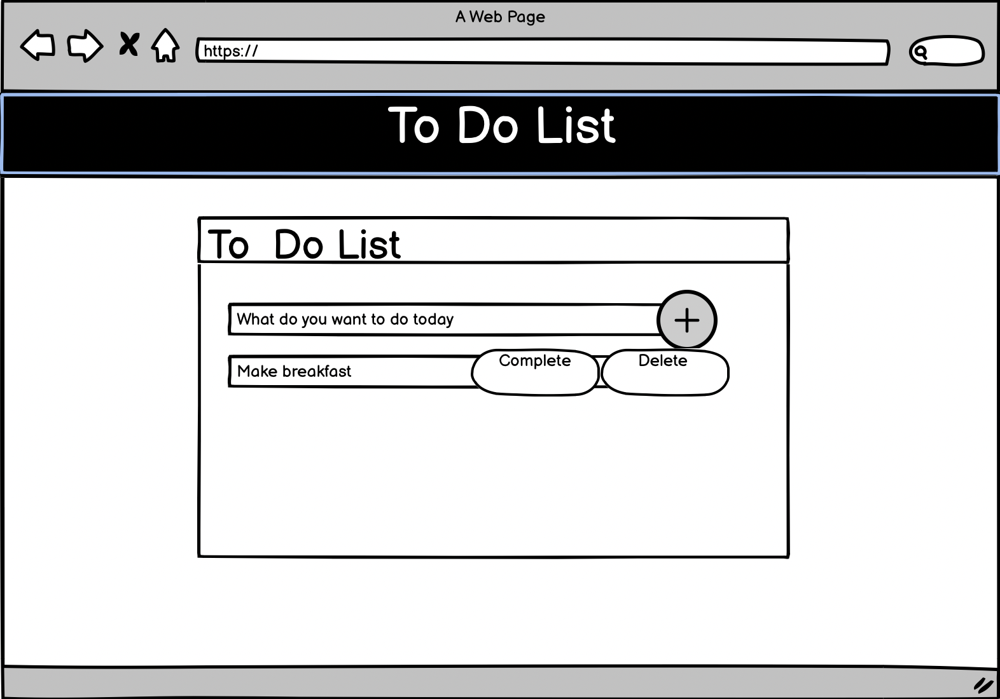

## To-Do List 

## Introduction 
Welcome to the To-Do List application which comes under the K and Triple J portfolio of JavaScript applications. This simple application enables the user to add tasks to be completed for the day. The user is also able to mark the task as completed or delete the tasks from the list. 

## Features

1. Add tasks to the To-Do List 
2. Mark tasks as complete
3. Delete tasks from the to-do list 

## Files 

1. index.html - the main file organising the structure of the application
2. style.css - a file to build the custom design of the application 
3. script.js - a file containing the application logic and interactivity

## Wireframe 
